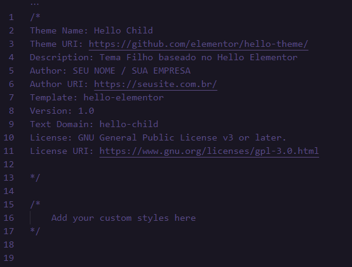

# Hello Child – Tema Filho para Hello Elementor

Este Tema Filho é disponibilizado para uso em conjunto com o tema "Pai" Hello Elementor. 

A única modificação que realizei, foi incluir no "functions.php" um pequeno código para que você possa substituir ou remover com facilidade o contexto "Resultados da Pesquisa por:" nos resultados de pesquisa/arquivo do Elementor, conforme explicado mais abaixo:

## O que é um Tema Filho para Elementor?

Um tema filho não é um tema isolado e independente, ele deve trabalhar em conjunto com seu tema "pai" existente.

Com um tema filho, você poderá realizar modificações com segurança em seu tema pai, sem a necessidade de editar os arquivos em seu tema principal.

Apesar de não estar alterando diretamente os arquivos do seu tema pai, toda alteração realiza no tema filho substituirá (sobrescrever) as configurações do tema pai.

## Vantagens de um Tema Filho

Mas então, por que eu precisaria de um Tema Filho se eu posso fazer as alterações que preciso direto no Tema Pai?

O principal motivo para isso, é proteger suas alterações e customizações das atualizações do Tema Pai, possibilitando manter o que não foi alterado atualizado e as alterações realizadas intactas.

Sendo assim, você poderá realizar todas as customizações no Tema filho e atualizar seu Tema Pai sem medo de perder todo o trabalho realizado.

Outro grande motivo para usar um Tema Filho é facilidade de reverter suas customizações ao padrão, bastando apenas desabilitar seu Tema Filho e ativar o Tema Pai.

## Quando usar um Tema Filho

Alguns temas já trazem o Tema Pai e Filho como padrão, mostrando que esse recurso vem se tornando uma boa prática no mercado.

Portanto, se você planeja realizar alterações no seu tema em algum momento, já deixa o Tema Filho configurado, facilitando seu trabalho no futuro.

## Quando não usar um Tema Filho

Bem, nem tudo são flores! E existem alguma ressalvas que pode dizer se você precisa ou não de um Tema Filho.

### Atualizações

Ao mesmo tempo que um Tema Filho trás como beneficio a proteção contra atualizações do seu trabalho, um ponto negativo é criado, afinal, se você copiou e editou muitos arquivos do Tema Pai, e estes arquivos não vão receber atualizações.

Portando, será necessário um trabalho adicional verificando cada update recebido para o Tema Pai, em busca de novos recursos e questões importantes que devem ser inseridas no seus arquivos do Tema Filho.

### CSS Customizado

Se você deseja apenas realizar pequenas alterações de CSS, ter um Tema Filho pode ser um exagero, afinal, você pode facilmente adicional seu CSS Custom no Personalizador do WordPress ou através do Plugin Simple CSS.

## Instalar e Configurar o Tema Filho para Elementor Hello

Para facilitar seu trabalho, deixei neste repositório o Tema Filho para Hello Elementor. Lembre-se, é necessário o Tema [Pai Hello Elementor Theme](https://br.wordpress.org/themes/hello-elementor/), seu funcionamento é bem simples:

### Instalação

- Clone este repositório para sua pasta /wp-content/themes (pode apagar o readme.md e o stylecss-print.png você vai precisar apenas da pasta hello-child).
- Na Administração do WordPress, ative seu novo tema "Hello Child"

Prontinho, agora já podemos fazer alguns ajustes básicos.

### Configuração

Temos como base, uma estrutura de 3 arquivos apenas, entenda cada um deles:

- **function.php** – Permite enfileirar a folha de estilo do tema pai. Sem isso, o tema filho não seria capaz de aplicar o CSS do tema pai, o que deixaria seu site super feio!
- **screenshot.png** – Imagem de Capa mostrada nos Temas do WordPress, suas dimensões são 1200x900px
- **style.css** – Aqui contém apenas algumas linhas de informações sobre seu Tema Filho, que você pode ou não alterar, entenda seu conteúdo;

#### Conteúdo do arquivo style.css

- **Theme Name:** O nome do seu Tema Filho
- **Theme URI:** O site do seu tema e sua documentação.
- **Description:** Uma breve descrição do tema.
- **Author:** O nome do autor do tema.
- **Author URI:** O site do autor do tema.
- **Template:** O nome da pasta do seu Tema Pai (conforme nomeado dentro da pasta wp-content/themes). Esta é a linha mais importante, pois o tema filho não funcionará sem ela.
- **Version:** O número da versão do seu tema filho.
- **Text Domain:** É usado para internacionalização. Você pode apenas anexar "-child" ao final do nome do modelo.
- **License:** Deixe o padrão como está.
- **License URI:** Deixe o padrão como está.

Tirando a linha modelo, todo restante é opcional, portanto, não se estresse com isso. Se atente apenas em inserir a pasta correta do seu Tema Pai na linha Modelo.

## Customizar o Tema Pai através do Tema Filho

Agora que seu Tema Filho está instalado e ativado, o processo de customização se torna mais simples. Se precisar alterar qualquer arquivo original do seu Tema Pai, basta copiar o arquivo desejado e colar na pasta do Tema Filho, seguindo toda a hierarquia, exemplo;

Se precisar alterar o arquivo "header.php" do tema pai, localizado em: **/wp-content/themes/hello-elementor/header.php**

Copie o arquivo "header.php" e cole na pasta "hello-child" seguindo a mesma hierarquia, ficando como:
**/wp-content/themes/hello-child/header.php**

Prontinho, agora você pode fazer as customizações do arquivo copiado para o Tema Filho, protegendo ele contra as atualizações do Tema Pai.

Divirta-se criando e personalizando Temas Filho usando esta estrutura como base.

Lembre-se sempre de testar tudo em um ambiente local ou de testes para depois inserir no seu ambiente de produção / site oficial.

## Colaboração

Este modelo foi trazido baseado no modelo do [Alpes Data](https://alpesdata.com.br/blog/hello-theme-child-tema-filho-para-elementor-hello/) na sua categoria de "Dicas Rápidas, Elementor". Esta dica deles já me salvou muitas vezes, por isso resolvi criar um repositório para ela e deixar salvo, para poder ajudar outros Devs da mesma forma que fui ajudado.

Este projeto está em desenvolvimento ativo e contribuições são bem-vindas. Se você tiver sugestões, melhorias ou correções de bugs, sinta-se à vontade para abrir uma pull request ou relatar problemas na seção "Issues" do projeto.

## Author

- Website - [Melksedeque Silva](https://github.com/Melksedeque/)
- Frontend Mentor - [@Melksedeque](https://www.frontendmentor.io/profile/Melksedeque)
- Twitter - [@SouzaMelk](https://twitter.com/SouzaMelk)